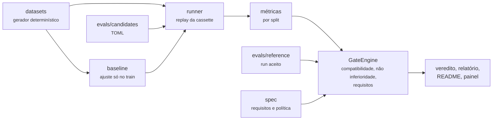

# llm-eval-gate

[](https://github.com/JulianoVinceCampos/llm-eval-gate/actions/workflows/pr-ci.yml)
[](https://github.com/JulianoVinceCampos/llm-eval-gate/actions/workflows/docker.yml)
[](https://sonarcloud.io/summary/new_code?id=JulianoVinceCampos_llm-eval-gate)
[](https://sonarcloud.io/summary/new_code?id=JulianoVinceCampos_llm-eval-gate)
[](https://scorecard.dev/viewer/?uri=github.com/JulianoVinceCampos/llm-eval-gate)
[](pyproject.toml)
[](LICENSE)

**Gate de CI que reprova o pull request quando a qualidade da saída do LLM regride.**
Veredito estatístico em três estados, spec executável e um baseline determinístico para
vencer. Zero dependência de runtime.

Trocar o modelo, o prompt ou a temperatura é mudança de código e merece o mesmo gate que
qualquer mudança de código. O problema é que "o modelo novo parece bom" não é critério, e
"a acurácia caiu de 91% para 89%" com 50 casos pode ser ruído ou pode ser regressão. Este
projeto transforma essa pergunta num check de PR com resposta honesta, **passa**,
**reprova** ou **inconclusivo**, e publica quanto cada uma dessas respostas erra.

## O resultado, em três linhas

- **As regras que já existem acertam 100% no vocabulário delas e 47,3% [41,8; 53,0] fora
  dele.** É o baseline de 31 regras do [postmortem-miner](https://github.com/JulianoVinceCampos/postmortem-miner),
  medido sobre o mesmo incidente escrito com outras palavras. É essa distância que um LLM
  precisa fechar, e o custo dele fica ao lado.
- **O gate aprova indevidamente uma regressão do tamanho da margem em no máximo 5,8% das
  vezes.** O bootstrap percentil, muito usado para pôr intervalo em métrica de avaliação,
  faria isso em 32,5% das vezes com 20 casos. Os dois números saem da calibração que o CI
  recalcula.
- **Com margem de 3 p.p., o gate só aprova com pelo menos 88 casos pareados por split,
  mesmo quando a evidência é idêntica.** Abaixo disso ele responde inconclusivo, porque com
  aquele n ninguém sabe.

## Por quê

Repositório que chama LLM existe aos milhares. Raro é o que traz a régua: um jeito de
dizer, num PR, se a mudança piorou a saída, com erro conhecido. Um número sem intervalo não
serve para isso, e um intervalo por bootstrap percentil também não: ele colapsa justamente
quando há poucos casos discordantes, e passa a regressão que não enxerga. A calibração
abaixo mede o tamanho do problema.

Três decisões dão forma ao projeto:

1. **O baseline vem antes da IA.** Um classificador de regras, determinístico e de custo
   zero, é o candidato em produção. Um LLM só entra medido contra ele, caso a caso.
2. **O PR nunca chama o modelo.** Ele reproduz respostas gravadas (cassettes) pelo workflow
   `live-eval`, com proveniência atestada. O gate roda em segundos, sem chave e com o mesmo
   resultado em qualquer máquina.
3. **"Não sei" é resposta.** Um gate que arredonda "não dá para dizer" para verde é como
   regressão chega à produção.

## Início rápido

```bash
git clone https://github.com/JulianoVinceCampos/llm-eval-gate
cd llm-eval-gate
python -m pip install -e .
llm-eval-gate ci           # o que o PR roda: artefatos, candidatos, veredito
llm-eval-gate scenarios    # quatro cenários com veredito conhecido
llm-eval-gate serve        # painel em http://127.0.0.1:8000
```

Python 3.11 ou mais novo, só a biblioteca padrão
([ADR-0001](docs/adr/ADR-0001-zero-dependencia-de-runtime.md)). Sem instalar nada:
`PYTHONPATH=src python -m llm_eval_gate.cli ci`.

| Comando | O que faz |
|---|---|
| `ci` | tudo o que o PR faz, na ordem: artefatos, depois cada candidato contra referência e spec |
| `gate <candidato>` | um candidato, com o relatório completo |
| `compare <a> <b>` | dois candidatos caso a caso: diferença pareada, McNemar, recall por classe com Holm, acurácia por operador |
| `run <candidato> --mode record` | grava evidência nova (é o que o `live-eval` roda) |
| `accept <candidato> --note "..."` | aceita um run como referência, com data, commit e motivo |
| `calibrate [--check]` | mede o erro e o poder do próprio gate |
| `datasets [--check]`, `fit [--check]` | regenera ou verifica os splits e o baseline |
| `readme [--check]` | regenera ou verifica o bloco de resultados deste README |
| `serve` | sobe o painel |

Exit code `0` passa, `1` o gate bloqueou ou um artefato divergiu, `2` configuração quebrada.
O CI distingue "o modelo regrediu" de "a configuração está errada" só pelo código.

## Como o gate decide

Para cada split, com os casos que o candidato e a referência aceita avaliaram, o gate
calcula a diferença pareada de acerto e um intervalo de 90% pelo score de Tango:

```text
lo ≥ -margem     PASSA          a perda maior que a margem está excluída
hi < -margem     REPROVA        está excluído que a perda caiba na margem
caso contrário   INCONCLUSIVO   os dados não sustentam nenhuma das duas
```

A política vive em `spec/policy.toml` (margem de 3 p.p., alfa unilateral de 0,05,
`on_inconclusive = "fail"`), e os requisitos em `spec/requirements.toml`:

| Check | Vale quando | Exemplo |
|---|---|---|
| Compatibilidade | há referência, ou o candidato está em produção | referência de outro dataset reprova |
| Não inferioridade, por split | há referência, em qualquer estágio | `in-dist` e `hard` |
| Requisito `block` | candidato em `production` | acurácia in-dist ≥ 95% pelo limite inferior, formato válido ≥ 99%, instabilidade ≤ 10%, p95 ≤ 5 s, custo por chamada ≤ US$ 0,0005 |
| Requisito `report` | nunca bloqueia; é medido e publicado | acurácia no difícil ≥ 80%, macro-F1 ≥ 0,75, recall por classe ≥ 70% |

Todo check roda, mesmo depois de um reprovar, e o relatório lista os casos que puxam cada
número para baixo. Uma referência só muda por `accept`, que chega ao repositório como diff
revisado; apagar a cassette de um candidato com referência reprova, para que apagar a
evidência não seja o caminho mais barato até o verde.

O desenho completo, com fluxos e sequências, está em [docs/fluxos.md](docs/fluxos.md).

## Resultados

<!-- llm-eval-gate:results:start -->

Gerado por `llm-eval-gate readme` a partir das referências aceitas em `evals/reference/`. O CI regenera este bloco e reprova se ele divergir do que está commitado.

| Candidato | Estágio | in-dist (IC95) | hard (IC95) | Formato válido | Instabilidade | p95 |
|---|---|---|---|---|---|---|
| `ollama-qwen2.5-0.5b` | experimental | n/d | n/d | n/d | n/d | n/d |
| `rules-signature` | production | 100.0% [98.1, 100.0] | 47.3% [41.8, 53.0] | 100.0% | 0.0% | 0.7 ms |
| `synthetic-calibrated` | experimental | 95.5% [92.2, 97.4] | 75.0% [70.0, 79.4] | 99.2% | 5.7% | 514.0 ms |

Cenários de validação do gate (modelo sintético, resultado conhecido):

| Cenário | Esperado | Obtido |
|---|---|---|
| Troca de modelo equivalente | PASSA | PASSA |
| Regressão real de 10 p.p. no split difícil | REPROVA | REPROVA |
| Regressão de 6 p.p. medida em 10% dos casos | INCONCLUSIVO | INCONCLUSIVO |
| Melhora real de 8 p.p. não é bloqueada | PASSA | PASSA |


Calibração do gate (erro e poder medidos, não presumidos):

Margem 3.0 p.p., alfa unilateral 0.05, 400 simulações por célula, acurácia de referência 85%, correlação 0.80. Os métodos decidem sobre os mesmos pares simulados; o bootstrap usa 500 reamostragens.

Como ler: na linha de efeito -3.0 p.p., igual à margem, `passa` é aprovação indevida e deveria ficar perto de 5%. Com efeito zero, `reprova` é alarme falso, e tudo o que não é `passa` bloqueia o PR quando `on_inconclusive = "fail"`.

- Score de Tango: aprovação indevida na margem de até 5.8%, alarme falso de até 0.2%.
- Wald+2: aprovação indevida na margem de até 7.0%, alarme falso de até 0.0%.
- Bootstrap percentil: aprovação indevida na margem de até 32.5%, alarme falso de até 1.2%.

| Casos | Efeito real | Score de Tango (passa / inconcl. / reprova) | Wald+2 (passa / inconcl. / reprova) | Bootstrap percentil (passa / inconcl. / reprova) |
|---|---|---|---|---|
| 20 | +0.0 p.p. | 2% / 98% / 0% | 2% / 98% / 0% | 60% / 39% / 1% |
| 20 | -1.5 p.p. | 0% / 99% / 1% | 0% / 100% / 0% | 44% / 52% / 4% |
| 20 | -3.0 p.p. | 0% / 99% / 1% | 0% / 100% / 0% | 32% / 62% / 5% |
| 20 | -6.0 p.p. | 1% / 93% / 6% | 1% / 98% / 2% | 17% / 66% / 16% |
| 20 | -12.0 p.p. | 0% / 78% / 22% | 0% / 88% / 12% | 4% / 57% / 39% |
| 50 | +0.0 p.p. | 12% / 88% / 0% | 23% / 77% / 0% | 34% / 66% / 0% |
| 50 | -1.5 p.p. | 6% / 91% / 2% | 11% / 88% / 1% | 19% / 79% / 2% |
| 50 | -3.0 p.p. | 2% / 92% / 6% | 5% / 94% / 1% | 9% / 85% / 6% |
| 50 | -6.0 p.p. | 0% / 84% / 15% | 1% / 91% / 8% | 2% / 83% / 15% |
| 50 | -12.0 p.p. | 0% / 46% / 55% | 0% / 55% / 45% | 0% / 46% / 55% |
| 100 | +0.0 p.p. | 28% / 72% / 0% | 40% / 60% / 0% | 50% / 50% / 0% |
| 100 | -1.5 p.p. | 10% / 88% / 1% | 16% / 84% / 0% | 21% / 79% / 0% |
| 100 | -3.0 p.p. | 4% / 87% / 8% | 7% / 88% / 5% | 11% / 84% / 5% |
| 100 | -6.0 p.p. | 0% / 76% / 24% | 2% / 81% / 18% | 2% / 79% / 18% |
| 100 | -12.0 p.p. | 0% / 20% / 80% | 0% / 24% / 76% | 0% / 23% / 77% |
| 300 | +0.0 p.p. | 72% / 28% / 0% | 74% / 26% / 0% | 78% / 22% / 0% |
| 300 | -1.5 p.p. | 23% / 77% / 0% | 26% / 74% / 0% | 29% / 71% / 0% |
| 300 | -3.0 p.p. | 6% / 90% / 4% | 7% / 90% / 4% | 8% / 88% / 4% |
| 300 | -6.0 p.p. | 0% / 46% / 54% | 0% / 50% / 50% | 0% / 51% / 49% |
| 300 | -12.0 p.p. | 0% / 0% / 100% | 0% / 0% / 100% | 0% / 1% / 99% |

<!-- llm-eval-gate:results:end -->

O candidato `synthetic-calibrated` não é um LLM: é um modelo sintético com acurácia-alvo
conhecida, que existe para exercitar no CI o caminho completo de um candidato amostrado
(repetições, instabilidade, saída inválida, latência, custo) antes da primeira gravação de
um modelo de verdade. O candidato Ollama aparece como pendente até o `live-eval` gravar a
primeira cassette; os números dele não são inventados antes disso.

## A estatística, em uma página

- **Acurácia com intervalo de Wilson no n efetivo de Kish.** Três respostas ao mesmo
  incidente não são três evidências independentes; o n efetivo sai da dispersão das taxas
  por caso ([ADR-0009](docs/adr/ADR-0009-acuracia-com-wilson-no-n-efetivo.md)).
- **Decisão pelo score de Tango**, com a variância avaliada sob a nula testada. Zero
  discordância em 30 casos ainda deixa espaço para uma perda de 3 p.p., como deve deixar
  ([ADR-0002](docs/adr/ADR-0002-nao-inferioridade-com-score-de-tango.md)).
- **Calibração publicada.** 400 simulações por célula, com efeito real conhecido, decididas
  pelo mesmo código do CI, comparando três métodos sobre os mesmos pares. A tabela está no
  bloco acima e o workflow `calibration` exige que ela saia igual byte a byte.
- **McNemar exato e Holm** como leitura de apoio na comparação entre candidatos.

Fórmulas, desenho da simulação, poder por tamanho de amostra e limitações:
[docs/metodologia-estatistica.md](docs/metodologia-estatistica.md).

## Usar no seu repositório

1. Copie `.github/workflows/eval-gate.yml` e `live-eval.yml`.
2. Descreva cada combinação de modelo, prompt e parâmetros em `evals/candidates/<nome>.toml`.
   Provider `ollama` ou `openai-compatible` (API hospedada, vLLM, llama.cpp, LM Studio); a
   chave vem de uma variável de ambiente nomeada no TOML.
3. Escreva a spec em `spec/requirements.toml` e a política em `spec/policy.toml`.
4. Grave a primeira evidência pelo `live-eval`, revise o PR e aceite a referência.

A partir daí, todo PR que muda prompt, modelo ou parâmetro precisa de evidência nova, e a
evidência nova precisa ser não inferior à aceita. O passo a passo está em
[docs/operacao.md](docs/operacao.md).

## Painel

```bash
llm-eval-gate serve        # http://127.0.0.1:8000
```

Oito telas, na ordem em que a pergunta aparece: **visão geral** do gate, **gate por
candidato** com os intervalos contra a margem, **e se?** (o mesmo dado redecidido com outra
margem, outro alfa ou menos casos, para ver o veredito virar inconclusivo), **regras x
LLM** caso a caso e por operador do split difícil, **rastreabilidade** de requisito a
casos, **casos** com filtro por split, rótulo e erro, **calibração** e **sobre**.

Credencial do portão de demonstração: usuário `julianovincedecampos`, senha
`llm-eval-gate`, sobrescrevível por `LEG_USER` e `LEG_PASSWORD`. A verificação acontece no
servidor, com cookie assinado por HMAC e limite de tentativas. É um portão sobre dado
sintético e somente leitura, não um controle de segurança, mas um portão validado no
navegador não seria portão nenhum.

Continua sem dependência de runtime: o servidor é `http.server`, o frontend não tem
framework nem CDN, e os gráficos são SVG gerado na hora
([ADR-0003](docs/adr/ADR-0003-dashboard-sobre-stdlib.md)).

## Container e deploy

```bash
docker compose up --build      # http://127.0.0.1:8000
```

A imagem não tem etapa de instalação, porque não há dependência a instalar: o código vai da
árvore de fontes para o container com `PYTHONPATH`. Base `python:3.13-slim` pinada por
digest, usuário não-root, `HEALTHCHECK` em `/api/health`; o compose ainda sobe com sistema
de arquivos somente leitura e sem nenhuma capability.

Em todo PR a imagem é construída, sobe e precisa responder como o deploy responde. Na
`main`, ela é publicada no GHCR com SBOM e atestação de proveniência, e o Render
(blueprint `render.yaml`, plano gratuito) constrói o mesmo commit só depois que os checks
passam.

## Como funciona



Três níveis de arquitetura no estilo C4 (contexto, containers, componentes) estão em
[docs/arquitetura.md](docs/arquitetura.md), e os padrões de projeto, com o problema que
cada um resolve aqui, em [docs/design-patterns.md](docs/design-patterns.md): Strategy para
os classificadores, Adapter e Decorator para os providers (`Recording(Retry(Budget(Ollama)))`),
Record and Replay para a evidência, Composite para os checks, Specification para os
requisitos, Facade para as operações e Observer para o progresso.

## Os datasets

Três splits sintéticos, gerados por código com seed fixa: `train` (120 casos, só para o
baseline), `in-dist` (200, vocabulário do template) e `hard` (300). O split difícil
descreve os mesmos incidentes sem o vocabulário das regras, com título opaco, omissões,
ruído, frases que descartam outro padrão citando-o, português e inglês misturados e
erros de digitação, e cada caso registra os operadores que recebeu.

Ele é **adversarial a regras de palavra-chave por construção**, e é dito assim: mede quanto
um classificador depende do vocabulário do template, não a acurácia de nada em produção.
Ficha completa em [docs/datasets.md](docs/datasets.md).

Nada aqui vem de sistema, cliente ou colega real: nomes de serviço, endereços e incidentes
são fictícios. Isso é imposto, não prometido. O gate `sanitize` bloqueia ids de instância e
de conta, documentos fiscais e endereços privados, e bloqueia nomes da organização a partir
de uma lista privada que nunca entra no repositório, porque uma lista pública de nomes
internos seria o próprio vazamento. É o **primeiro** job do CI, antes do lint: um vazamento
no histórico público é o único erro deste repositório que não dá para desfazer.

## Esteira de CI/CD

```text
sanitize ─▶ lint ─▶ build-test ─▶ coverage, eval-gate, semgrep, codeql, sca ─▶ sonar ─▶ supply-chain ─▶ ci-status
```

| Estágio | O que garante |
|---|---|
| `sanitize` | formas genéricas em duas engines (scanner stdlib e Semgrep), nomes da organização por lista privada vinda de secret, e gitleaks sobre o histórico inteiro |
| `lint` | ruff, formatação, `mypy --strict`, tipografia da casa, actionlint nos workflows e hadolint no Dockerfile |
| `build-test` | testes em Python 3.11, 3.12 e 3.13, e os artefatos regenerados em cada versão batendo com os commitados |
| `coverage` | cobertura de linha e ramo com ratchet: o piso em `.coverage-floor` só sobe |
| `eval-gate` | o produto julgando o próprio repositório |
| `semgrep`, `codeql` | SAST em Python, JavaScript e nos próprios workflows |
| `sca` | dependency review e `pip-audit` num ambiente separado do auditor |
| `sonar` | quality gate do SonarCloud, que espera o resultado antes de ficar verde |
| `supply-chain` | wheel, sdist, SBOM CycloneDX e atestação de proveniência |
| `ci-status` | o único check a exigir na proteção de branch |

Fora do `pr-ci`: `docker` (imagem, sonda e publicação), `calibration` (a tabela recalculada
quando a estatística muda e toda semana), `live-eval` (gravação de evidência), `release`
(release-please a partir de Conventional Commits) e `scorecard` (OpenSSF). Toda action é
pinada por SHA de commit. Todo workflow disparado por evento nasce somente leitura, a
escrita fica no job que precisa dela, e cada workflow reutilizável declara exatamente o que
o job chamador concede.

## Limitações

- **Os datasets são sintéticos.** A variedade é a do léxico, não a de um acervo real
  escrito por dezenas de pessoas.
- **Ainda não há gravação de LLM.** O candidato Ollama está configurado e o workflow de
  gravação existe, mas a tabela só mostra o número quando a cassette existir.
- **O acerto é exato por rótulo.** Não há juiz-modelo; saída em texto livre pediria outra
  métrica e outra estatística.
- **Custo é custo-sombra.** Modelo local custa zero em dinheiro e não em computação; o
  preço por milhão de tokens vem do TOML do candidato.
- **A gravação em CPU é lenta.** Dezenas de minutos por candidato no runner gratuito.
- **A atestação da cassette ainda não é verificada no PR**; é verificável à mão
  ([docs/threat-model.md](docs/threat-model.md)).

## Documentação

| Documento | Conteúdo |
|---|---|
| [arquitetura.md](docs/arquitetura.md) | contexto, containers e componentes no estilo C4, e fronteiras de confiança |
| [fluxos.md](docs/fluxos.md) | fluxo do `ci`, decisão de não inferioridade, vida de um candidato, sequências de PR, gravação, aceite e painel |
| [design-patterns.md](docs/design-patterns.md) | cada padrão, onde está e o problema que resolve |
| [metodologia-estatistica.md](docs/metodologia-estatistica.md) | métricas, score de Tango, calibração, dimensionamento e limitações |
| [datasets.md](docs/datasets.md) | ficha dos datasets e o que o split difícil mede |
| [threat-model.md](docs/threat-model.md) | ativos, atores, ameaças, controles e riscos residuais |
| [operacao.md](docs/operacao.md) | runbook: gate vermelho, gravação, aceite, deploy e configuração do repositório |
| [ADR-0001 a ADR-0010](docs/adr/) | as decisões de desenho e as alternativas rejeitadas |
| [SECURITY.md](SECURITY.md), [CONTRIBUTING.md](CONTRIBUTING.md) | política de segurança e como contribuir |

## Licença

MIT. Veja [LICENSE](LICENSE).
