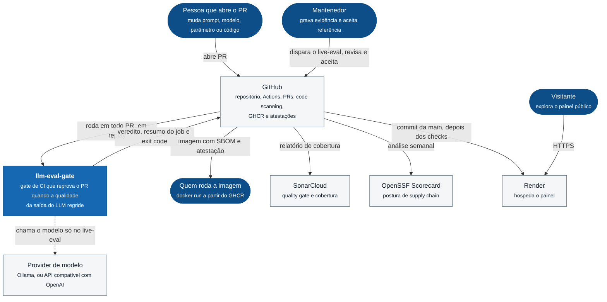
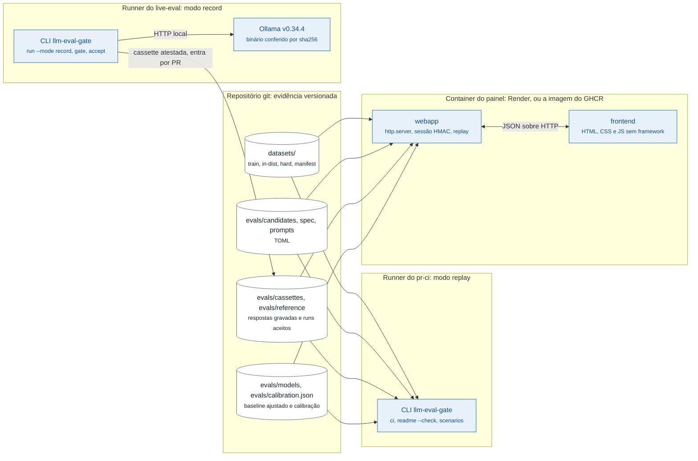
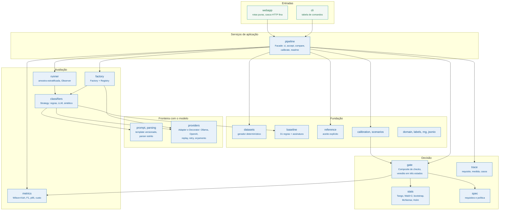

# Arquitetura

Três níveis de zoom no estilo C4 (contexto, containers, componentes) e, no fim, as
fronteiras de confiança. Os fluxos e as sequências ficam em [fluxos.md](fluxos.md); os
padrões de projeto, em [design-patterns.md](design-patterns.md).

Os diagramas usam `flowchart` do Mermaid com a notação do C4 (pessoa, sistema, container,
componente) em vez do tipo `C4Context`, que o GitHub ainda renderiza como experimental.

## Nível 1: contexto

O que o sistema é para quem está de fora, e com quem ele conversa.

A seta pontilhada é a decisão central do desenho ([ADR-0004](adr/ADR-0004-replay-no-pr-gravacao-no-ci.md)):
o PR nunca fala com o modelo. Ele reproduz a evidência gravada, então roda em segundos,
sem chave e com o mesmo resultado em qualquer máquina.

## Nível 2: containers

Onde o código roda e o que cada lugar lê ou escreve. A evidência não mora num banco: mora
no próprio repositório, versionada, e toda mudança nela chega como diff de PR.

| Container | Tecnologia | Responsabilidade |
|---|---|---|
| CLI no runner do PR | Python 3.11+, só biblioteca padrão | provar que os artefatos batem com os geradores e julgar cada candidato contra a referência e a spec |
| CLI no runner do live-eval | a mesma CLI, mais Ollama em versão fixa | gravar a evidência nova, atestar e abrir o PR |
| Painel | `http.server`, imagem `python:3.13-slim` pinada por digest, usuário não-root | expor o mesmo julgamento para exploração, somente leitura |
| Repositório | git | ser a única fonte de verdade da evidência |

## Nível 3: componentes do pacote

Os módulos de `src/llm_eval_gate/` e a direção das dependências. As setas apontam de quem
usa para quem é usado.

Todo módulo depende de `core` (tipos de domínio, rótulos, aleatoriedade determinística,
IO canônico); essas setas ficam de fora para o desenho continuar legível.

### O que cada componente garante

**`pipeline`** é a única porta de entrada para as operações. A CLI, o CI e o painel chamam
as mesmas funções, então o painel não pode virar uma segunda fonte de verdade: a tabela que
ele mostra é o resultado de `evaluate_candidate`, a mesma que o `ci` imprime.

**`factory`** decide o que fica atrás de um candidato a partir do TOML e do modo
(`replay`, `live`, `record`). É o único lugar que conhece provider concreto.

**`classifiers`** implementa um protocolo, três estratégias. O `runner`, as métricas e o
gate nunca sabem qual estão medindo.

**`gate`** compõe os checks (compatibilidade, não inferioridade por split, um check por
requisito) e reduz os vereditos ao pior deles entre os que valem para o estágio. Todo check
roda, mesmo depois de o primeiro reprovar, para o relatório sair completo.

**`stats`** é matemática pura, sem IO, com cada método nomeado e citado. A escolha do
método que decide é da política, não do código ([ADR-0002](adr/ADR-0002-nao-inferioridade-com-score-de-tango.md)).

**`providers`** é a porta para fora. O protocolo tem um método; o adapter de cada vendor,
o replay da cassette, a gravação, o retry e o orçamento implementam o mesmo protocolo e se
empilham.

**`parsing`** trata a saída do modelo como entrada não confiável: aceita um objeto JSON com
um rótulo do catálogo e transforma o resto em `invalid`, que entra na métrica de formato.

### O que a direção das setas garante

Nada abaixo de `pipeline` importa `cli` ou `webapp`. O núcleo roda igual num runner, num
laptop e dentro do container, e o painel existe sem que o caminho da CLI ganhe dependência
ou ramo condicional. `stats` e `gate` não fazem IO, o que é o que permite à calibração
decidir 24 mil vezes com exatamente o código que o CI roda.

## Fronteiras de confiança

| Fronteira | Do lado de fora | Controle |
|---|---|---|
| Texto do caso para o modelo | conteúdo do dataset, que num uso real vem de gente | prompt marca o texto como dado entre delimitadores; a saída passa pelo parser estrito |
| Saída do modelo para o gate | texto arbitrário | `parsing` aceita só rótulo do catálogo; o resto conta como falha de formato |
| Configuração para a rede | URL e nome de variável de chave vindos do TOML | só `http` e `https`, sem credencial na URL, opener sem `file://` nem redirect, resposta limitada em tamanho e tempo |
| Internet para o painel | qualquer requisição | sessão assinada, limite de login, corpo limitado, JSON obrigatório, checagem de `Origin`, CSP estrita, grade fechada no what-if |
| PR para `main` | qualquer mudança de evidência | cassette e referência são arquivos versionados; mudança aparece no diff e o gate a julga |

O detalhamento de ameaças e riscos residuais está em [threat-model.md](threat-model.md).
