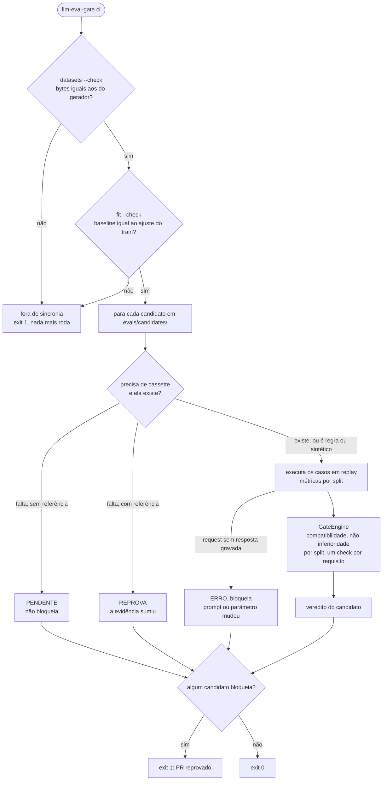
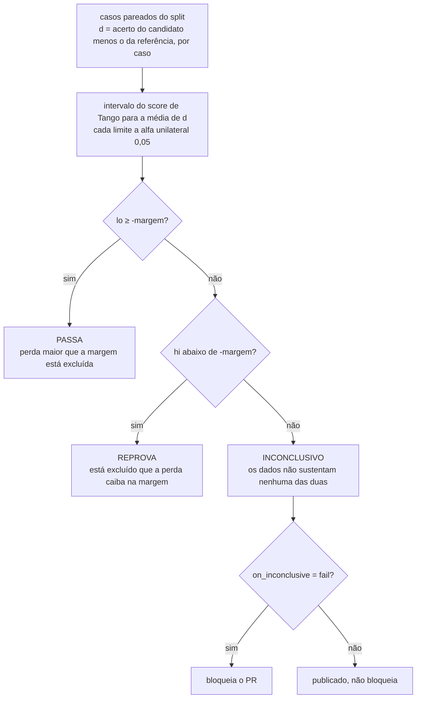
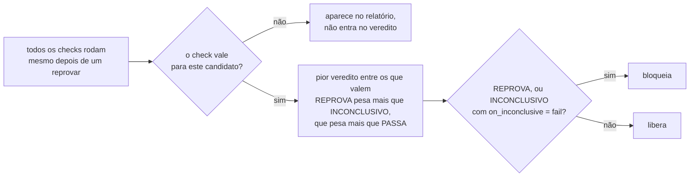
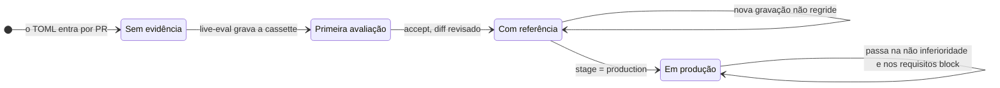
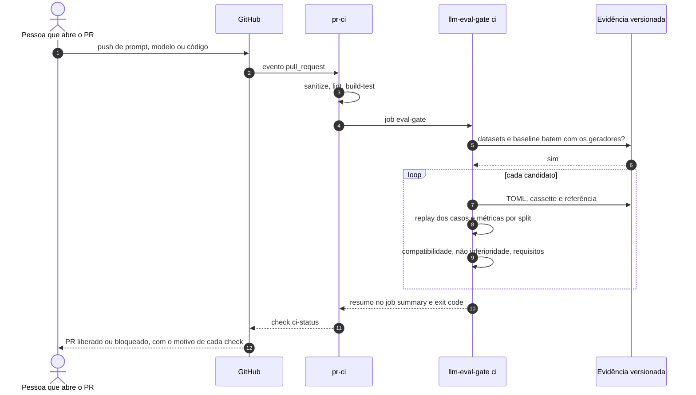
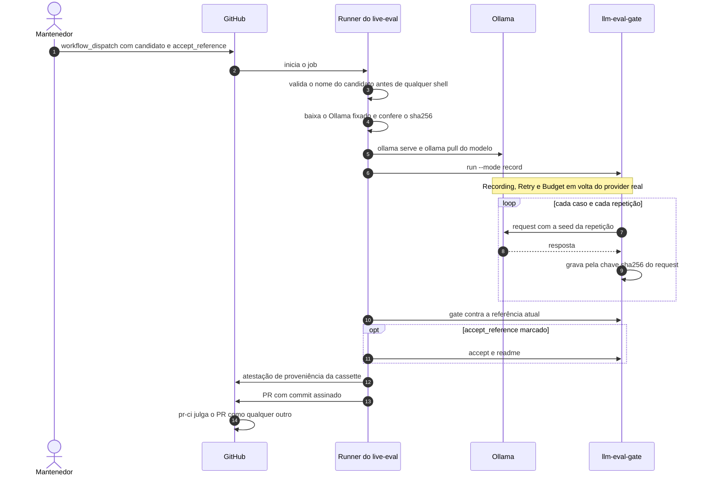
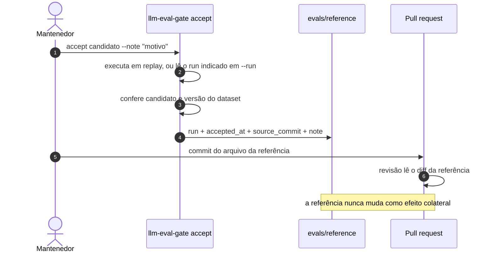
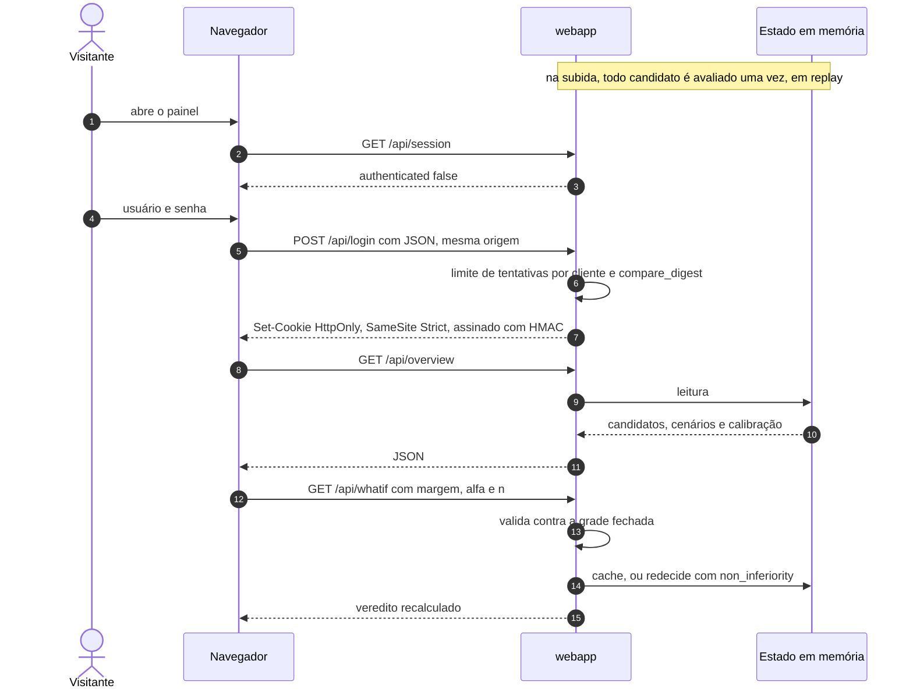

# Fluxos e sequências

Como uma decisão acontece, do push ao veredito. Primeiro os fluxos (o que é decidido e em
que ordem), depois as sequências (quem fala com quem). A estrutura estática está em
[arquitetura.md](arquitetura.md).

## Fluxo 1: o que `llm-eval-gate ci` faz

É o comando que o job `eval-gate` roda em todo PR, e o mesmo que qualquer time copiaria
para o próprio pipeline.

A ordem é o argumento: se os artefatos não são o que os geradores produzem, nenhum número
seguinte merece confiança, então o comando para ali. Os exit codes separam as causas:
`1` é "o modelo regrediu" ou "um artefato divergiu", `2` é configuração quebrada (TOML
inválido, prompt ausente, schema de artefato antigo).

## Fluxo 2: um check de não inferioridade

Um por split (`in-dist` e `hard`), contra a referência aceita do candidato.

Com a política atual (margem de 3 p.p., `on_inconclusive = "fail"`), um candidato só passa
com pelo menos 88 casos pareados por split, mesmo idêntico à referência. A conta está em
[metodologia-estatistica.md](metodologia-estatistica.md#6-dimensionamento).

## Fluxo 3: como o motor junta os checks

Quem vale para quem:

| Check | Vale quando |
|---|---|
| Compatibilidade com a referência | há referência, ou o candidato está em produção (produção sem referência reprova) |
| Não inferioridade por split | há referência, em qualquer estágio |
| Requisito `block` | o candidato está em `production` |
| Requisito `report` | nunca bloqueia; é medido e publicado |

## Fluxo 4: a vida de um candidato

- **Sem evidência:** aparece como pendente e não bloqueia. Nenhum número é publicado.
- **Primeira avaliação:** há cassette, não há referência. Nada a comparar; os requisitos
  são medidos e publicados.
- **Com referência:** toda nova evidência precisa ser não inferior à aceita. Apagar a
  cassette a partir daqui reprova.
- **Em produção:** além disso, todos os requisitos `block` precisam ser atendidos.

## Sequência 1: um pull request comum

## Sequência 2: gravar evidência nova (`live-eval`)

O veredito da gravação vai para o corpo do PR, mas não impede a gravação: o PR existe
justamente para que o gate diga, na frente de todos, se a evidência nova regrediu.

## Sequência 3: aceitar uma referência

## Sequência 4: o painel

O what-if é a única computação exposta à rede. A grade fechada (alfa em quatro valores,
margem em passos de 0,5 p.p. até 20 p.p., n em cinco tamanhos) e o cache LRU impedem que o
endpoint vire amplificador de CPU.
